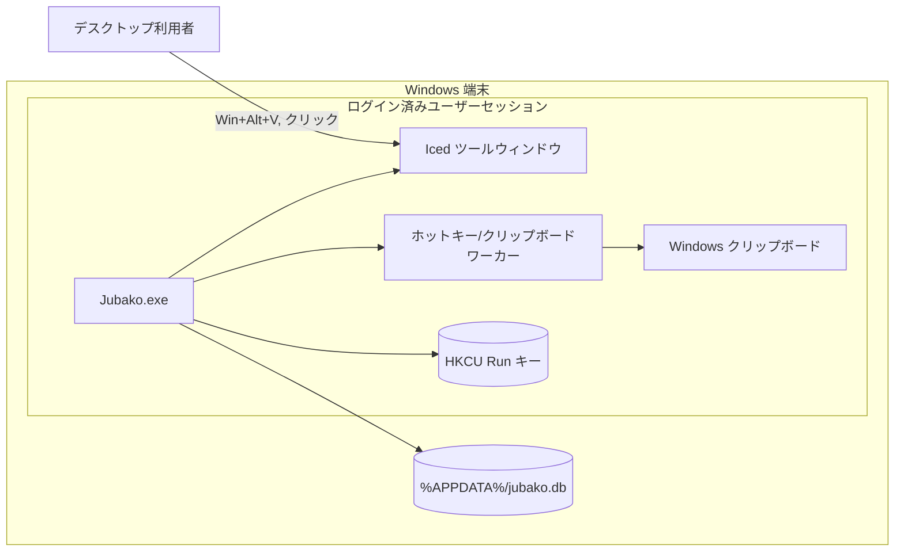

# デプロイメント

## 目的

Jubako の実行配置、依存するローカルリソース、Windows ワークステーション上での実行境界を整理します。

## トポロジ

## 実行環境

| ノード | 実行環境 | 領域/ゾーン | スケーリング | オーナー |
| --- | --- | --- | --- | --- |
| `Jubako.exe` プロセス | Rust ネイティブバイナリ（`edition=2021`） | ローカル Windows ユーザーセッション | 常駐 1 プロセス（起動時に同名既存プロセスを終了） | デスクトップアプリ開発者 |
| Iced UI ウィンドウ | `iced` イベントループ | 同一プロセス・同一セッション | 非表示/表示を切り替える単一ウィンドウ | デスクトップアプリ開発者 |
| クリップボード/ホットキーワーカー | Tokio タスク + OS メッセージループスレッド | 同一プロセス・同一セッション | イベント駆動（OS コールバック頻度に依存） | デスクトップアプリ開発者 |
| SQLite DB ファイル | `rusqlite`（WAL モード） | ローカルアプリデータディレクトリ | プロセス内 Mutex による単一書き込み | デスクトップアプリ開発者 |

## ネットワーク境界

- すべての構成要素は単一端末内で動作し、待受ソケットやサービス間通信はありません。
- 信頼境界は Windows ユーザーセッションで、クリップボード/ホットキー/レジストリ書き込みは当該ユーザー文脈に限定されます。
- 保存データ境界は `jubako.db` を保持するローカルプロファイルディレクトリです。

## セキュリティと運用メモ

- スタートアップ永続化は `HKCU\\Software\\Microsoft\\Windows\\CurrentVersion\\Run` に設定され、`--no-autostart` で無効化できます。
- 既定ではバックグラウンドプロセス（`--background`）で起動し、ホットキー入力までツールウィンドウを隠します。
- SQLite は WAL と外部キーを有効化しており、ローカル書き込みの耐障害性を高めています。
- 現状の運用ログは標準エラー出力のみで、集中監視向けテレメトリは未実装です。
- 起動時に同一実行ファイル名の既存常駐プロセスを終了し、シングルトン動作を担保しています。

