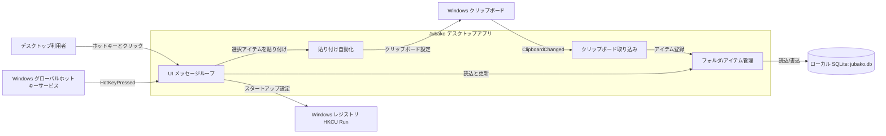

# システムコンテキスト

## 目的

Jubako をローカルファーストのクリップボードマネージャーとして位置付け、デスクトップ利用者・Windows プラットフォームサービス・アプリ内部モジュールの境界を明確化します。

## 対象範囲

この文書は、ユーザーセッション内で動作する単一実行ファイル（`jubako`）、SQLite によるローカル永続化、クリップボード更新・グローバルホットキー・スタートアップ登録の OS 連携を対象とします。

## 図

## 要素

| 名称 | 種別（User/System） | 責務 | インターフェース |
| --- | --- | --- | --- |
| デスクトップ利用者 | User | ポップアップ表示、アイテム参照、フォルダ管理、貼り付け対象選択 | キーボード（`Win+Alt+V`）、マウスクリック、ドラッグ＆ドロップ |
| Jubako デスクトップアプリ | System | クリップボード更新の取り込み、保存、UI 表示、貼り付け実行 | プロセス内メッセージ処理（`Message` enum）、UI イベント |
| Windows グローバルホットキーサービス | System | グローバルホットキー押下を通知 | `global-hotkey` の受信ストリーム |
| Windows クリップボード | System | テキスト/画像データの入力元と出力先 | `arboard` API、`WM_CLIPBOARDUPDATE` リスナー |
| ローカル SQLite（`jubako.db`） | System | フォルダとアイテムを永続化 | `Db` の `rusqlite` クエリとマイグレーション |
| Windows レジストリ（`HKCU\\...\\Run`） | System | バックグラウンド起動コマンドを保存 | `winreg` の read/write |

## 前提と未確定事項

- 現状は端末プロファイルごとの単一対話ユーザーを前提としています。
- アプリ独自認証はなく、信頼境界はログイン済み Windows セッションに委譲しています。
- リモート同期境界は未導入であり、将来クラウド同期を追加する際は本コンテキストの再定義が必要です。

