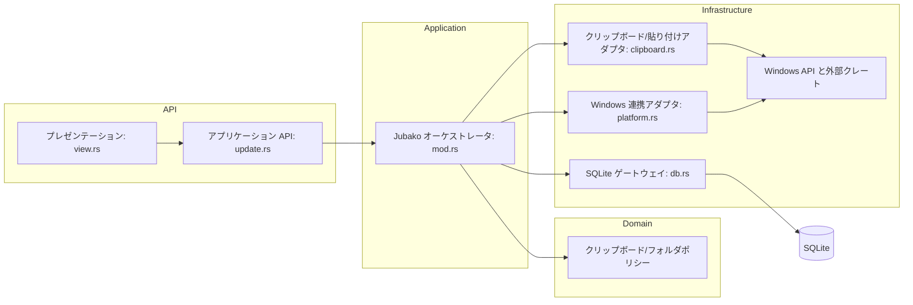

# コンポーネント

## 目的

Jubako の内部コンポーネント、依存方向、OS 依存を局所化する境界ルールを定義します。

## 図

## コンポーネント一覧

| コンポーネント | 責務 | 依存先 | 公開インターフェース |
| --- | --- | --- | --- |
| プレゼンテーション（`view.rs`） | UI 要素構築、状態のウィジェット反映、意図イベント発行 | `Jubako` 状態、`Message` enum | `Jubako::view`、描画補助関数 |
| アプリケーション API（`update.rs`） | メッセージ振り分け、状態更新、副作用制御 | `clipboard`、`Db` API、window task | `Jubako::update` |
| オーケストレータ（`mod.rs`） | 起動処理、購読設定、状態ライフサイクル、ウィンドウ制御 | `platform`、`db`、`clipboard`、`iced` runtime | `run`、`subscription`、load/refresh 系メソッド |
| 永続化ゲートウェイ（`db.rs`） | スキーマ初期化、CRUD、マイグレーション、重複チェック | `rusqlite`、`chrono`、filesystem | `Db` 構造体メソッド群 |
| クリップボード/貼り付けアダプタ（`clipboard.rs`） | クリップボード読み書き、画像メタ解析、貼り付け実行 | `arboard`、`enigo`、tokio 遅延 | `poll_clipboard`、`set_text_and_simulate_paste`、`set_image_and_simulate_paste` |
| プラットフォームアダプタ（`platform.rs`） | スタートアップ登録、リスナーウィンドウ、モニタ/カーソル取得 | `windows` crate、`winreg`、threading | `ensure_startup_registration`、カーソル/ウィンドウ補助関数 |

## 依存ルール

- `view.rs` は OS API や永続化層を直接呼ばず、すべて `Message` とリデューサ経由で副作用を実行します。
- `update.rs` / `mod.rs` はインフラ層に依存できますが、インフラ層から UI 層への逆依存は禁止です。
- `db.rs` はストレージ責務に限定し、テーマ・ウィンドウ状態・ウィジェット等の UI 概念を持ち込みません。
- Windows 固有処理は `platform.rs` に寄せ、`cfg(target_os = "windows")` の分散を避けます。

## テスト容易性メモ

- 現状は具象アダプタ依存のため、クリップボード/DB に trait 境界を導入すると単体テスト分離性が向上します。
- 重複排除やフォルダ移動ルールはテーブル駆動テスト化に向いています。
- UI は現状統合寄りなので、スナップショット/回帰テストを追加すると表示崩れリスクを減らせます。

