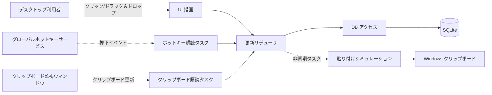

# 実行単位

## 目的

Jubako 内の主要な実行単位、トリガー、同期/非同期連携の成立方法を整理します。

## 図

## 実行単位責務

| 実行単位 | トリガー | 責務 | 管理データ | 障害影響 |
| --- | --- | --- | --- | --- |
| UI 描画（`view.rs`） | ユーザー入力、表示/非表示切替 | サイドバー/一覧/ダイアログ描画と UI 意図の発行 | メモリ上の表示状態投影 | 描画失敗時にアイテム操作不可 |
| 更新リデューサ（`update.rs`） | `Message` イベント | 状態遷移と副作用の制御 | `Jubako` 状態（`current_view`、ドラッグ状態、ダイアログ状態） | イベント処理停滞や状態不整合 |
| ホットキー購読 | OS ホットキー押下 | 押下イベントを `ToggleWindow` に変換 | 永続データなし | ショートカットでポップアップを開けない |
| クリップボード購読 | `WM_CLIPBOARDUPDATE` 通知 | クリップボードポーリングと重複排除起動 | 最終観測テキスト/画像ハッシュ | 新規コピーが取り込まれない |
| DB アクセス（`db.rs`） | リデューサ呼び出し | SQLite へのフォルダ/アイテム永続化と取得 | `folders` / `items` テーブル | 履歴/フォルダ情報が欠落・陳腐化 |
| 貼り付けシミュレーション（`clipboard.rs` + Enigo） | 貼り付け対象選択 | クリップボード設定と `Ctrl+V` 擬似入力 | 当該操作のクリップボード内容 | 選択後の貼り付け失敗 |

## 連携パターン

- UI 操作、ホットキー、クリップボード通知は 1 本のリデューサ経路（`Message` 処理）に集約されます。
- ストレージ操作は同期実行で、単一 SQLite 接続を Mutex で保護します。
- 貼り付けシミュレーションは、ウィンドウを隠した後に実行するため短い遅延付き非同期タスクで処理します。
- リトライ境界は最小で、失敗時は主にログ出力して継続します。

## スケーリングと分離メモ

- 本アプリは意図的に単一プロセス・単一ユーザー設計であり、水平スケール対象ではありません。
- 分離はプロセス分離ではなく機能分離で、UI・プラットフォームアダプタ・永続化をモジュール境界にしています。
- バックプレッシャーはイベントループに依存し、明示的なキュー深度制御はありません。

