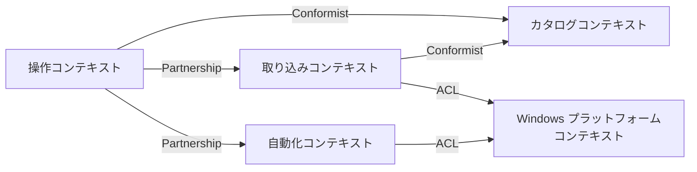

# コンテキストマップ

## 目的

Jubako 内部の境界づけられたコンテキストを示し、操作系・取り込み系・自動化系・カタログ系で責務と言語がどう分離されるかを整理します。

## 図

## コンテキスト一覧

| コンテキスト | 中核責務 | ユビキタス言語 | オーナー |
| --- | --- | --- | --- |
| 操作コンテキスト | ポップアップ表示、フォルダツリー/一覧管理、ユーザー意図の収集 | View, Dialog, Drag-and-Drop, ToggleWindow | デスクトップアプリ開発者 |
| 取り込みコンテキスト | クリップボード更新検知とペイロード正規化 | Clipboard Update, Deduplication, Image Description | デスクトップアプリ開発者 |
| カタログコンテキスト | SQLite のフォルダ/アイテム永続化と参照 | Folder, Item, History, Favorite | デスクトップアプリ開発者 |
| 自動化コンテキスト | 選択アイテム反映と擬似貼り付け実行 | Paste Simulation, Hide Window, Ctrl+V | デスクトップアプリ開発者 |
| Windows プラットフォームコンテキスト | OS イベントと起動連携の提供 | Hotkey, Run Key, Monitor DPI, WM_CLIPBOARDUPDATE | Windows OS API |

## 関係タイプ

- `Interaction -> Capture` は同一プロセス・同一チームで `Message` 契約を共有するため Partnership。
- `Interaction -> Catalog` は `Db` が公開するスキーマ/クエリ形状に追従するため Conformist。
- `Capture -> Catalog` は重複排除後のデータをカタログ側テーブル構造へ保存するため Conformist。
- `Capture/Automation -> Windows Platform` は `platform.rs`/`clipboard.rs` を ACL として使い、API 差分を隔離します。

## 統合契約

- `Message` enum が操作フローと実行ロジックを接続する内部契約です。
- 画像メタデータは `"<width>x<height>:<hash>"` を `content_data` に保存し、RGBA 本体を `content_blob` に格納します。
- カタログ契約はメソッド単位（`insert_item`、`get_history`、`move_item_to_folder` 等）で、`Item`/`Folder` を返します。
- スタートアップ契約は HKCU Run に保存される `"<path-to-exe>" --background` コマンド文字列です。

