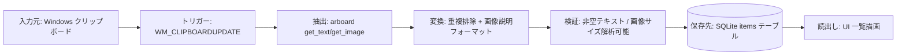
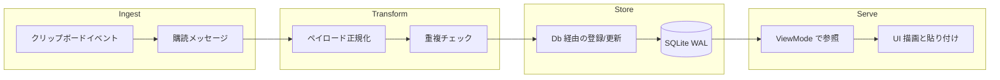

# データパイプラインとデータフロー

このファイルは data-flow と data-pipeline の共有ドキュメントです。

<!-- BEGIN:data-flow -->
## データフロー図

### 図

### データ契約

| Flow | Input Schema | Output Schema | Validation |
| --- | --- | --- | --- |
| テキスト取り込み | OS クリップボードの UTF-8 テキスト | `content_type='text'`、`content_data=<text>`、`folder_id=NULL` の `items` 行 | 空文字は無視。履歴重複検知時は挿入スキップ |
| 画像取り込み | OS クリップボードの画像バイト列 + サイズ | `content_type='image'`、`content_data='<w>x<h>:<hash>'`、`content_blob=<rgba>` の `items` 行 | 最終画像ハッシュ比較と説明文字列重複チェック |
| UI 用アイテム取得 | `ViewMode` + フォルダ識別子 | `Item` 構造体の並び | `folder_id` 条件付き SQL + `created_at DESC` ソート |

### 変換

- 生のクリップボード値を `Item` モデルへ正規化します。
- 画像ペイロードはメタデータ（`content_data`）とバイナリ本体（`content_blob`）に分割します。
- イベント単位の重複排除は、最終観測値比較と DB チェックの組み合わせで実施します。
- UI 描画では長いラベル/本文を省略表示しますが、保存値自体は変更しません。
<!-- END:data-flow -->

<!-- BEGIN:data-pipeline -->
## データパイプライン図

### ステージ

| Stage | Runtime | Input | Output | Owner |
| --- | --- | --- | --- | --- |
| Ingest | クリップボード監視スレッド + 購読タスク | クリップボード更新信号 | クリップボードアダプタへのポーリング要求 | デスクトップアプリ開発者 |
| Transform | `clipboard.rs` の正規化ロジック | 生テキスト/生画像ペイロード | 正規化済み `content_type`、`content_data`、任意 `content_blob` | デスクトップアプリ開発者 |
| Store | `db.rs` + SQLite 取引境界 | 正規化済みアイテム | 永続化済み `items`/`folders` 行 | デスクトップアプリ開発者 |
| Serve | UI 描画 + リデューサ参照経路 | ビュー選択とユーザー操作 | アイテム/フォルダ一覧と貼り付け処理 | デスクトップアプリ開発者 |

### 図

### スケジューリングと SLA

- パイプライン起動は OS クリップボード通知を起点とするイベント駆動で、cron 実行はありません。
- クリップボードポーリングは購読ループ 1 サイクルあたり最大 1 秒待機します。
- コピー後の履歴反映は体感即時（通常 1 秒未満）を目標とします。
- 貼り付け時はウィンドウ非表示との競合回避のため、キー送信前に約 150ms の意図的遅延を入れます。

### 障害時ハンドリング

- クリップボード read/write 失敗はログ出力して処理をスキップし、プロセスは継続します。
- DB の insert/query 失敗時は可能な範囲でデフォルト値を返します（参照経路の `unwrap_or_default`）。
- 任意列 `content_blob` のマイグレーション失敗は許容し（`run_migrations` がエラーを無視）、起動継続性を優先します。
- イベントチャネル断が起きても購読側は `Noop` を発行し、ループを継続します。
<!-- END:data-pipeline -->

