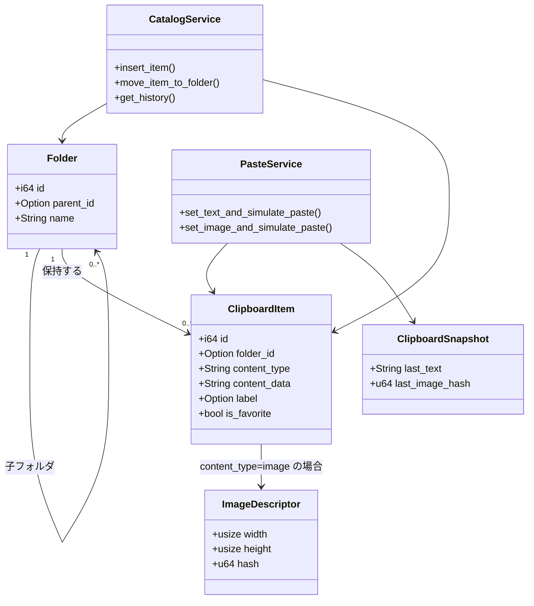

# ドメインモデル

## 目的

クリップボード履歴、階層フォルダ、ユーザー主導の貼り付け操作を表す中核エンティティと集約を整理します。

## 図

## 集約

| 集約 | ルート | 構成要素 | 不変条件 |
| --- | --- | --- | --- |
| フォルダ階層 | `Folder` | 子 `Folder` ノード、フォルダ配下 `ClipboardItem` 参照 | フォルダ名は非空、`parent_id` で 1 つのツリーを構成、フォルダ削除は子孫/配下アイテムへカスケード |
| クリップボードカタログ | `ClipboardItem` | 任意の `ImageDescriptor`、任意のラベル/お気に入り属性 | `content_type` は必須、履歴は `folder_id = NULL`、画像は解析可能な説明文字列と blob が必要 |
| セッションクリップボードスナップショット | `ClipboardSnapshot` | `last_clipboard_content`、`last_clipboard_image_hash` | 同一セッション内での重複取り込み抑止のため最終観測値を保持 |

## 不変条件

- 履歴ビューは `folder_id IS NULL` で表現され、フォルダ移動時は具体的な `folder_id` を設定します。
- フォルダ/アイテム作成時にはタイムスタンプが必須です。
- 重複チェック（`check_duplicate`、`check_image_duplicate`）はベストエフォートで、履歴エントリを主対象とします。
- アイテム削除とフォルダ削除は現在の UX では取り消し不可です。

## ライフサイクルメモ

- 新しいクリップボードイベントで履歴に `ClipboardItem` が作成されます。
- ドラッグ＆ドロップで `History` と各フォルダ間を遷移し、`folder_id` を更新します。
- フォルダはユーザー操作で作成・改名・削除され、削除時はカスケードで子要素が整理されます。
- 貼り付けライフサイクルは「選択 -> クリップボード設定 -> ウィンドウ非表示 -> `Ctrl+V` 擬似入力」です。

