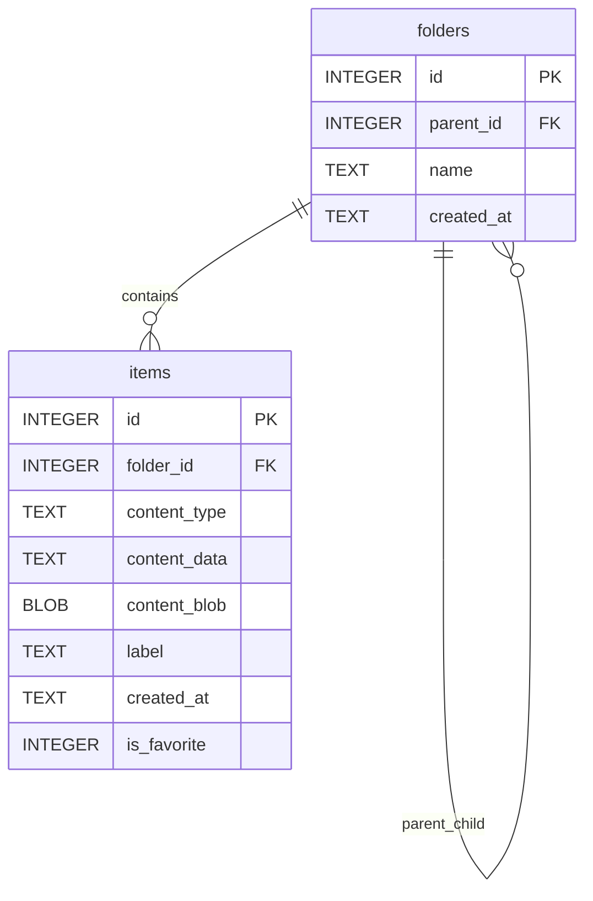

# ER 図

## 目的

Jubako で使用する物理データモデルを整理し、クリップボード履歴を安定運用するための整合性制約を明文化します。

## 図

## テーブル一覧

| テーブル | PK | 主要カラム | FK | カーディナリティ補足 |
| --- | --- | --- | --- | --- |
| `folders` | `id` | `name`, `created_at`, `parent_id` | `parent_id -> folders.id`（`ON DELETE CASCADE`） | 1 フォルダは複数の子フォルダを持てる |
| `items` | `id` | `content_type`, `content_data`, `content_blob`, `label`, `is_favorite`, `created_at` | `folder_id -> folders.id`（`ON DELETE CASCADE`、nullable） | 1 フォルダは複数アイテムを持てる。`NULL folder_id` は履歴を表す |

## 整合性ルール

- 接続初期化時に外部キー制約を有効化します（`PRAGMA foreign_keys = ON`）。
- フォルダ/アイテムの主要列（`name`、`content_type`、`content_data`、`created_at`）は non-null です。
- フォルダ削除時は子フォルダ/配下アイテムへ自動カスケード削除されます。
- `is_favorite` は整数（`0`/`1`）で保持し、デフォルトは `0` です。
- `content_blob` はマイグレーション追加列であり、非画像エントリでは `NULL` を許容します。

## インデックスメモ

- 主キーインデックスは両テーブルで暗黙作成されます。
- 現状、`created_at`、`folder_id`、重複チェック列向けの明示的副次インデックスは未設定です。
- 履歴件数増加時の推奨追加インデックスは `items(created_at DESC)`、`items(folder_id, created_at DESC)`、必要に応じて `(folder_id, content_data)` です。

