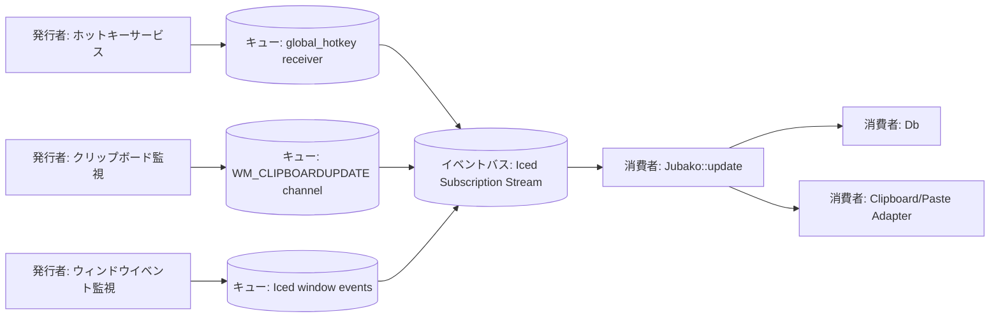

# イベントフロー

## 目的

Jubako の動作を駆動する非同期イベントを可視化し、発行者/消費者の意味論を記述します。

## 図

## イベント一覧

| イベント | 発行者 | 消費者 | ペイロード要約 | 配信セマンティクス |
| --- | --- | --- | --- | --- |
| `HotKeyPressed` | Windows グローバルホットキーサービス | 更新リデューサ | ホットキー ID + 押下状態 | 受信 OS イベントごとに高々 1 回 |
| `ClipboardUpdated` | Windows クリップボード監視スレッド | 更新リデューサ | クリップボード更新シグナル（実データは遅延取得） | ベストエフォート。連続更新は集約され得る |
| `WindowUnfocused` | Iced ウィンドウリスナー | 更新リデューサ | フォーカス喪失イベント | コールバックごとに高々 1 回 |
| `CloseRequested` | Iced ウィンドウリスナー | 更新リデューサ | クローズ要求意図 | コールバックごとに高々 1 回 |
| `PasteItem/PasteImageItem` | UI 操作 | クリップボードアダプタ | 選択アイテム ID / 内容 | クリックごとに高々 1 回 |

## 配信とリトライ方針

- 永続ブローカーはなく、キューはすべてメモリ内ランタイムチャネルです。
- リスナー障害時はアプリを停止せず、`Noop` と sleep ループで継続します。
- DB/クリップボード副作用は指数バックオフ再試行を行わず、失敗時はログ出力してスキップします。
- イベント順序はソースストリーム単位では維持されますが、全体での厳密順序は保証しません。

## 可観測性

- 現状の可観測性は標準エラー出力（`eprintln!`）と UI 目視確認に限定されます。
- イベント ID や相関 ID がないため、横断的トレースは困難です。
- 改善案として、イベント種別・アイテム ID・結果を含む構造化ログ導入を推奨します。

