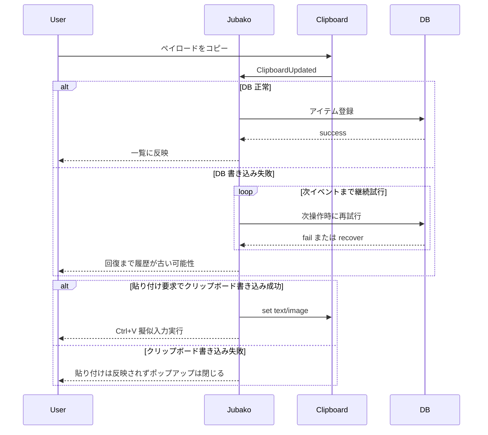

# フォールトトレランス

## 目的

部分障害時における Jubako の挙動を、検知・初動・復旧条件・ユーザー影響の観点で整理します。

## 障害シナリオ

| シナリオ | 検知方法 | 初動対応 | ユーザー影響 | 復旧トリガー |
| --- | --- | --- | --- | --- |
| クリップボード read/write 失敗 | `arboard` がエラーを返す | エラーログを出し当該イベントをスキップ | 直近コピーが保存されない、または貼り付け失敗 | 次のクリップボード更新または再貼り付けで回復 |
| SQLite 操作失敗 | `rusqlite` がエラーを返す | 既定値返却または変更処理中断 | 履歴/フォルダの更新欠落や古い表示 | 後続 DB 操作成功時に回復 |
| 起動時ホットキー登録失敗 | `register(hotkey)` 失敗（`expect`） | 起動時にプロセス中断 | ポップアップを開けない | 競合解消後の再起動 |
| 監視チャネル切断 | recv が切断/エラーを返す | `Noop` を返しループ継続 | 一時的なイベント遅延 | ストリーム復帰または再起動 |
| 画像ペイロード不整合 | サイズ解析失敗または blob 欠落 | 対象画像の貼り付け要求を無視 | 選択画像を貼り付けできない | 再コピーで正常エントリを再作成 |

## シーケンス

## 復旧と縮退ポリシー

- 失敗操作をスキップしつつイベントループを維持する縮退方針を採用します。
- 復旧は基本的に機会的で、次の成功イベント/呼び出しで通常挙動へ戻します。
- 今後の強化案として以下の閾値を推奨します。
  - DB 連続書き込み失敗 3 回でアラート。
  - クリップボード貼り付け連続失敗 3 回で UI 警告表示。
  - 一時的なクリップボード書き込み失敗に対する有界リトライ（例: 2 回、100ms バックオフ）。

## 運用ランブックフック

- プロセス健全性確認: `jubako.exe` 常駐が 1 インスタンスであることを確認。
- DB パス/権限確認: `%APPDATA%` 配下の DB 位置とファイル権限を確認。
- ホットキー競合確認: 登録経路を再現し、競合ショートカット有無を確認。
- 再現時ログ採取: 標準エラー出力を収集し、失敗種別と文脈を記録。

