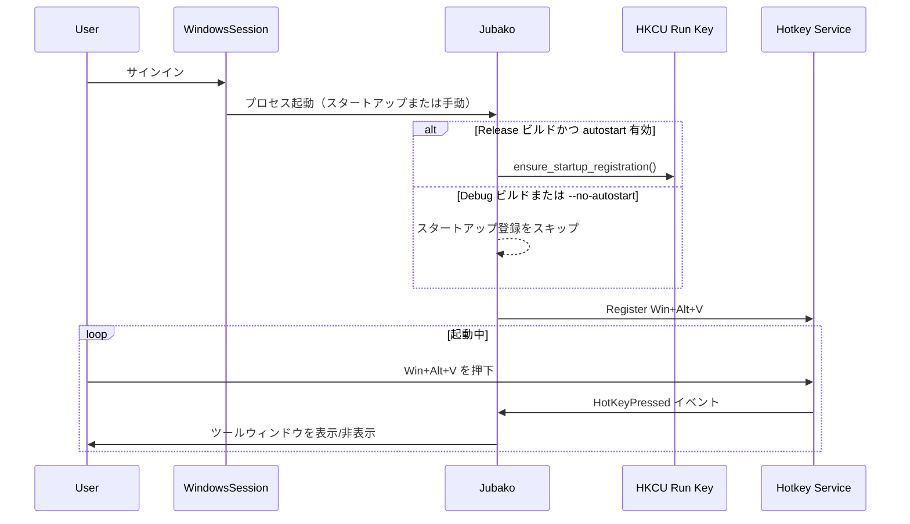

# 認証とセッショントラスト

## 目的

Jubako が Windows ユーザーセッション上でどのように信頼され、起動されるかを示します。なお、アプリ独自ログインは存在しません。

## 前提条件

- Windows デスクトップセッションにユーザーがログイン済みであること。
- `jubako.exe` が配置され、当該ユーザー文脈で実行可能であること。
- 必要に応じて `--no-autostart` なしで起動し、スタートアップ登録が有効であること。

## シーケンス

## 異常系

- レジストリ書き込み失敗時はエラーログを出し、スタートアップ永続化なしで継続します。
- ホットキー登録失敗時は現行実装（`expect`）で起動時 panic となり、ポップアップは利用できません。
- バックグラウンド分離起動に失敗した場合はフォアグラウンド動作へフォールバックします。

## メモ

- 認証はアプリ内 ID 基盤ではなく、Windows アカウント/セッション制御に依存します。
- セキュリティ水準は端末アカウント運用と OS ロックポリシーに左右されます。

