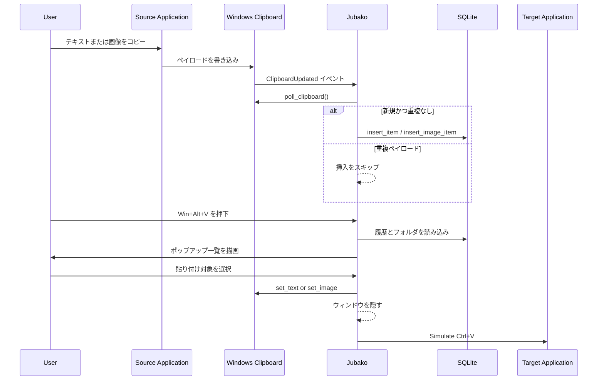

# 主要クリップボード貼り付けフロー

## 目的

クリップボード取り込みから履歴/フォルダ参照、選択アイテムの貼り付けまで、主要ユーザージャーニーを記述します。

## 前提条件

- Jubako のバックグラウンドプロセスが動作中であること。
- クリップボード監視とホットキー購読が有効であること。
- SQLite データベースが初期化済みであること。

## シーケンス

## 異常系

- クリップボード読み取り失敗時はイベントを無視し、新規アイテムは保存されません。
- DB 挿入失敗時はエラーログのみで、履歴に表示されません。
- 選択画像で blob 欠落やサイズ解析失敗がある場合は貼り付けを中断します。
- 擬似キー送信失敗時はクリップボード更新後でも貼り付け先に反映されない可能性があります。

## メモ

- 履歴エントリは起動時にセッション単位で初期化されます（`folder_id IS NULL` を `clear_history`）。
- フォルダ配下アイテムは再起動後も保持され、`folder_id = NULL` に戻すことで履歴側へ戻せます。

