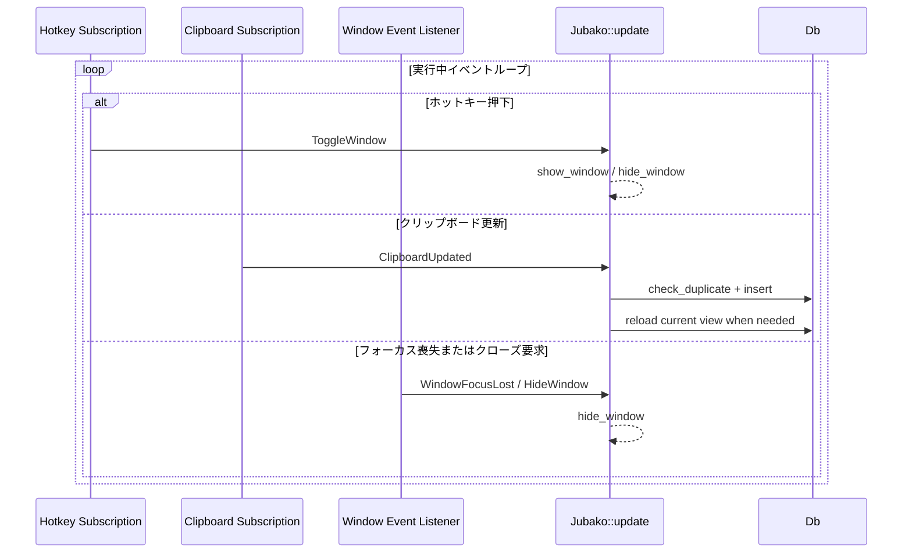

# 非同期イベント処理

## 目的

ホットキー、クリップボード更新、UI イベントが単一リデューサへ統合される並行実行時の振る舞いを説明します。

## 前提条件

- ホットキーストリーム、クリップボードストリーム、ウィンドウイベントの購読が登録済みであること。
- Iced 設定により Tokio ランタイム連携が有効であること。

## シーケンス

## 異常系

- 受信タスクの spawn-blocking 失敗時は `Noop` を発行し、短時間後に再試行します。
- クリップボード監視チャネル切断時もポーリングループは継続し、回復可能障害として扱います。
- リデューサ副作用（DB/クリップボード）失敗時はログのみ出力し、イベントループを継続します。

## メモ

- イベント処理は実質「少なくとも試行する」方式で、永続キューによる厳密リトライは行いません。
- 設計方針は厳密保証よりも、応答性とプロセス継続性を優先しています。

