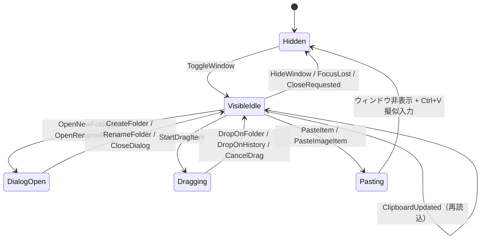

# 状態遷移

## 目的

ポップアップ操作モデルのライフサイクル状態と、ホットキー・クリップボード更新・ユーザー操作で発生する遷移を定義します。

## 図

## 遷移ルール

| 遷移元 | イベント/コマンド | ガード条件 | 遷移先 | 副作用 |
| --- | --- | --- | --- | --- |
| `Hidden` | `ToggleWindow` | プロセスが実行中 | `VisibleIdle` | フォルダ/アイテム再読込、ウィンドウ移動とフォーカス |
| `VisibleIdle` | `WindowFocusLost` または `HideWindow` | モーダルダイアログ未表示 | `Hidden` | ツールウィンドウ非表示、一時 UI 状態リセット |
| `VisibleIdle` | `OpenNewFolder` / `OpenRenameFolder` | リネーム対象 ID が有効 | `DialogOpen` | ダイアログ表示と入力値保持 |
| `DialogOpen` | `CreateFolder` / `RenameFolder` | 入力名が空でない | `VisibleIdle` | フォルダ変更を永続化し再読込 |
| `VisibleIdle` | `StartDragItem` | 対象アイテムが一覧に存在 | `Dragging` | ドラッグ中アイテム ID とドロップ先ハイライト保持 |
| `Dragging` | `DropOnFolder` / `DropOnHistory` | ドラッグ中 ID が存在 | `VisibleIdle` | `folder_id` 更新、ドラッグ状態解除、再読込 |
| `VisibleIdle` | `PasteItem` / `PasteImageItem` | アイテム内容を解決できる | `Pasting` | クリップボード設定、ウィンドウ非表示、キー入力タスク予約 |
| `Pasting` | 非同期タスク完了 | 常に成立 | `Hidden` | 擬似キー送信後に `Noop` 発行 |

## ガード条件と副作用

- ダイアログ遷移はフォルダ名が非空であることを条件とします。
- 画像貼り付けはサイズメタデータ解析成功と blob 存在を必須条件とします。
- ドラッグ状態がない場合のドロップ遷移は無視されます。
- `Hidden` 状態でも `ClipboardUpdated` はバックグラウンド購読経由で永続化更新を続行します。

## 運用メモ

- ホットキーとフォーカスイベントは競合し得るため、最終表示状態はリデューサ処理順に依存します。
- チャネル切断時はプロセス終了ではなくポーリング継続で縮退運転します。
- 禁止遷移例は `StartDragItem` なしの `DropOnFolder`、リネームダイアログ未表示時の `RenameFolder` です。

